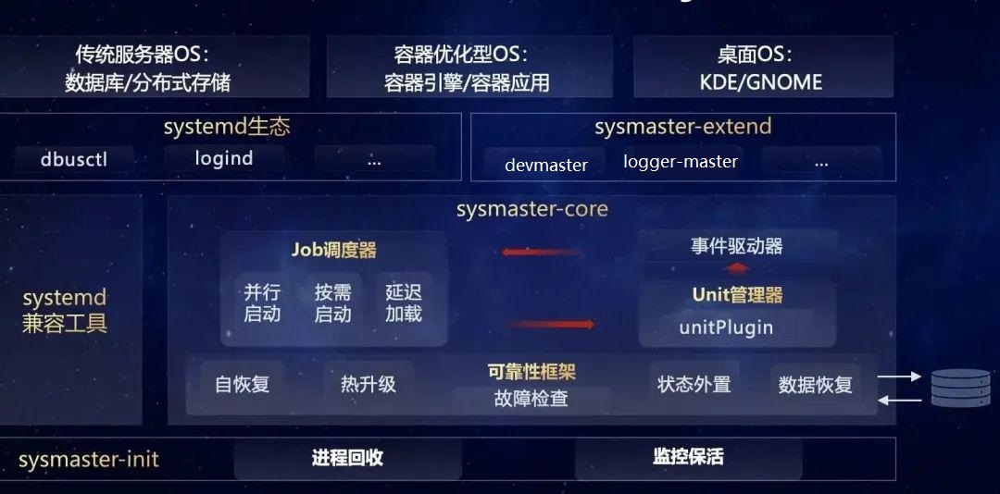
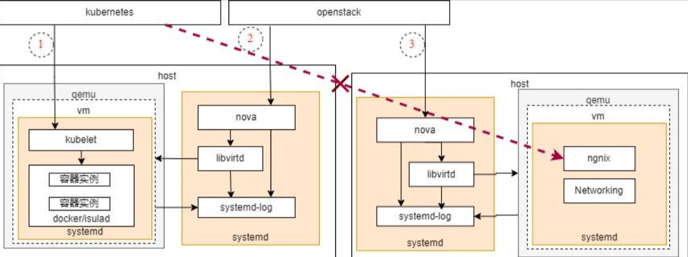
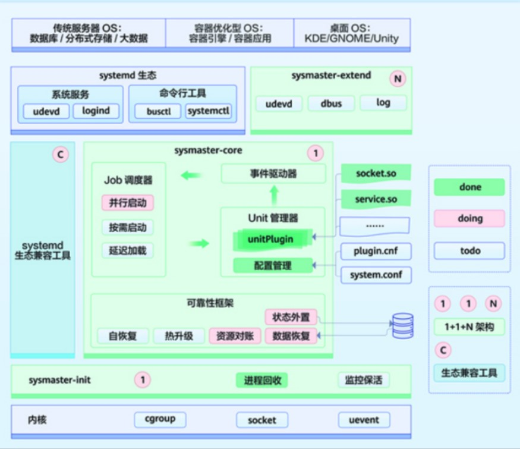
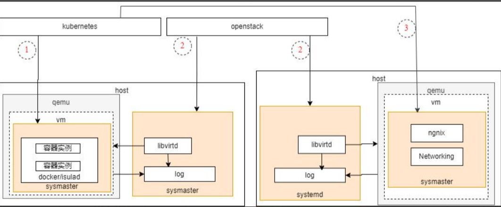

| hide          |
| ------------- |
| navigationtoc |

# Home

## Why Do We Develop sysMaster?

sysMaster is developed by openEuler after summarizing the problems and characteristics of Linux system initialization and service management in different scenarios, such as embedded, server, and cloud. sysMaster provides unified management for system initialization and services (processes, containers, and VMs) in embedded, server, and cloud scenarios.



## Initialization System and Service Management of Linux

As we all know, process 1 is the first userspace process started by the kernel in all Unix systems. It is the prerequisite for stable OS running. It is the representative of OS initialization programs (some tool sets actually used in initialization). In addition, process 1 needs to run in the background to reap orphan processes, to ensure that the system works properly. The initialization systems that you are familiar with include sysvinit, Upstart of Debian and Ubuntu, and systemd. The systems have their own characteristics. For details, see the following table.

| Initialization Software | Description                                                  | Start Management | Process Recycling | Service Management | Parallel Startup | Device Management | Resource Control | Log Management |
| ----------------------- | ------------------------------------------------------------ | ---------------- | ----------------- | ------------------ | ---------------- | ----------------- | ---------------- | -------------- |
| sysvinit                | Initialization process tool that was used in earlier versions but now gradually fades out of the stage | ✓                | ✓                 |                    |                  |                   |                  |                |
| upstart                 | Init daemon used by Debian and Ubuntu                        | ✓                | ✓                 | ✓                  | ✓                |                   |                  |                |
| systemd                 | Improves the system startup speed. This software is a major innovation compared with the traditional System V and has been used by most Linux distributions. | ✓                | ✓                 | ✓                  | ✓                | ✓                 | ✓                | ✓              |

systemd is a huge improvement over sysvinit, especially in terms of the startup speed. systemd provides more and more functions, which however complicates the system architecture and implementation. Some scenarios do not require so many functions, and these functions cannot be flexibly combined. Besides, systemd cannot support embedded devices and some IoT devices well.

According to the statistics, the number of maintenance problems in each systemd version is increasing in recent years. In addition, due to the particularity of process 1, these problems may cause system-level breakdown.


## Cloud Service Management

In cloud scenarios, the objects to be managed are changed from processes to VMs and containers. For example, OpenStack, Kubernetes, and agents (kubelet and nova) on nodes are used for management. The agents are managed by systemd on the nodes, and systemd is used to provide some basic capabilities, such as log output.

systemd is used to manage the life cycle of some key services, such as Ngnix, on a node (VM or host). These services are distributed. If a fault occurs, the service handles the fault by itself, unlike container instances and VM instances that can be orchestrated in a unified manner through platforms similar to Kubernetes and OpenStack.



## What Should sysMaster Focus On?

OS initialization and service management are critical functions. As scenarios and external forms change, a unified system initialization and service management framework is expected to eliminate existing problems and adapt to traditional and cloud scenarios. For the initialization and service management of the Linux system, our objectives are to:

1. Eliminate the memory security problems of the existing initialization system to reduce the possibility of faults.
2. Support quick deployment, upgrade, and recovery, achieving second-level fault recovery without affecting services.
3. Be lightweight and flexible, meeting different resource overhead requirements in scenarios such as embedded, server, and cloud.

For running instances (such as containers, VMs, and processes) on nodes in cloud scenarios, our objectives are to:

1. Provide unified instance life cycle management interfaces to interconnect with distributed management frameworks (such as Kubernetes and OpenStack) and shield the differences between container engines and virtualization management platforms.
2. For key cloud services in VMs, reuse the capabilities of the current cloud instance scheduling platform to implement distributed management.

## Reliable and Lightweight, Suitable for Embedded, Server, and Cloud Scenarios



sysMaster uses the 1+1+N architecture with multi-level splitting to ensure that each component focuses on its own responsibilities, reduce the complexity of a single component, and ensure the simplicity of the component architecture. This improves the scalability and adaptability of the overall system architecture and reduces the development and maintenance costs. sysMaster has the following features:

1. Lightweight scheduling for fast startup. sysMaster-core is the job scheduler. The event driver processes related startup tasks. The job scheduler schedules service startup tasks, provides lightweight and parallel scheduling capabilities, and supports transaction capabilities to ensure atomicity of service startup. The event driver receives external events and drives the job scheduler to complete event-related tasks, such as management and control commands and device discovery.
2. Plug-in architecture for flexible expansion of service types. The unit manager provides a plug-in mechanism, supports dynamic loading of various service types, and supports flexible expansion of services.
3. External status, multi-level checkpoints, and language-level native security. External status is supported. Multi-level checkpoints can be customized. Resource reconciliation and data self-recovery are implemented to achieve quick fault rectification. In addition, live upgrade is supported. The memory-safe programming language Rust is used for development, which improves the robustness of process 1 as well as overall system reliability.
4. Seamless migration from systemd to sysMaster. An ecosystem migration tool is provided to allow customers and developers to quickly switch from systemd to sysMaster, implementing seamless switchover and migration.
5. Native support for HarmonyOS microkernel and Linux kernel. sysMaster is positioned to support a wide array of scenarios such as embedded, server, and cloud. It provides a unified service management framework for the microkernel and macrokernel.

## Unified Management Interfaces and Distributed Scheduling Framework

Based on the characteristics of existing O&M scenarios, sysMaster works with the container engine (iSulad) and QEMU to provide unified management interfaces for container instances and virtual instances, and some key application instances managed by sysMaster are transferred to Kubernetes and OpenStack for unified management.



## Milestones and Vision of the sysMaster Project


## Code Directory Structure Description

The source repository is managed using workspaces. Each directory is a package, and each package contains a crate (.lib or .bin format). The public lib crate directory is prefixed with **lib** and created using **cargo new --lib libtests**. The bin crate directory of the daemon type ends with d.

```
/ (Root directory)
|...coms (Plugin)
|     |...service (unit type crate)
|     |...socket  (unit type crate)
|     |...target  (unit type crate)
|...libs (External interface)
|     |...libtests (test lib crate)
|     |...cgroup (cgroup lib crate)
|     |...cmdproto(cmd proto lib crate)
|...exts (sysMaster-extends component)
|     |...devmaster (daemon)
|     |...random-seed (bin)
|...core (sysMaster-core component)
|     |...sysmaster (bin)
|     |...sysmaster (internal lib)
|...tools
|     |...musl_build
|     |...run_with_sd
|...docs
|...requirements.sh (Installation dependencies)
```

Example:

```
  - lib crate: libs/event, libs/basic
  - bin crate: extends/init, sysmaster
  - daemon crate: extends/udevd, extends/logind
```
