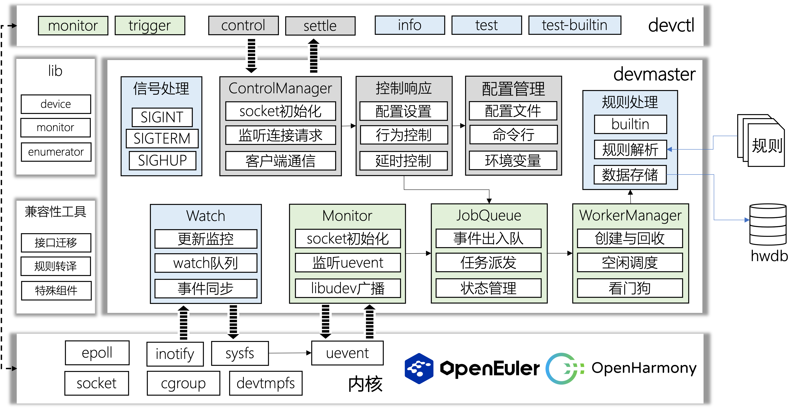
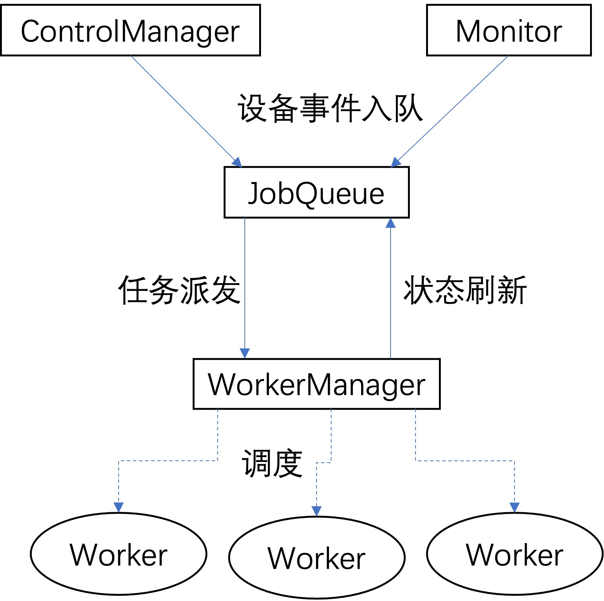
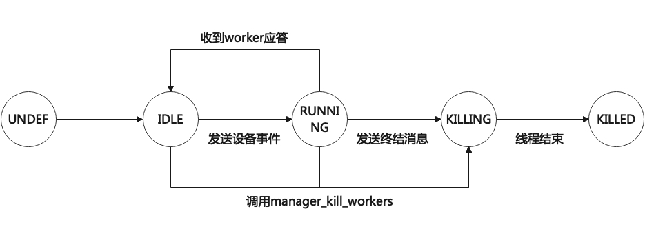
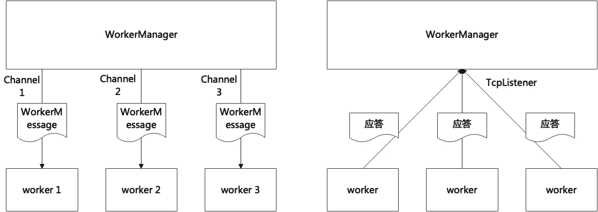
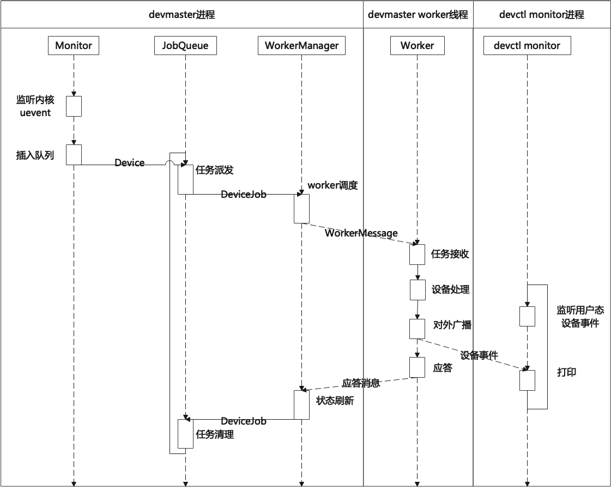

# devmaster设计文档

**Abstract 摘要**：
`devmaster`是`sysmaster`的设备管理模块，其机制与策略分离的设计思想提供了优秀的灵活性和可扩展能力，另一方面`devmaster`采用了并发程序框架，有效地利用了多核硬件资源的并发能力。`devmaster`通过`inotify`机制监听设备写操作并同步触发`change`类型的`uevent`事件，并通过监听内核上报的``uevent``事件从而感知设备动作，使得在设备热插拔、格式化等操作后能及时更新设备信息。

`devmaster`在设备处理上使用了规则解析策略，使用者可以根据业务需求编写定制化的设备处理规则，避免了策略硬编码问题，提高`devmaster`在使用上的灵活性和可扩展性。为了充分利用硬件设备的多核处理能力，`devmaster`采用了单生产者多消费者的并发框架，`daemon`进程集中监听`uevent`事件并通过任务队列对事件进行缓存调度，当任务队列中存在待处理事件时，`worker`管理器会分配一个空闲的`worker`进行任务派发，同一时刻运行有多个`worker`同时处理多个无依赖关系的设备事件。`devmaster`使用状态机模型管理`worker`和设备事件的执行状态，及时进行回收、释放等状态更新动作。设备管理是支持1号进程在虚拟机、物理机等场景下部署运行必不可少的能力，因此`devmaster`是`sysmaster`的核心扩展模块之一。

**Keywords 关键词**： *设备管理*

## 1 概述

devmaster是sysmaster的设备管理模块，是支撑1号进程在虚拟机、物理机环境中部署运行的核心能力之一。devmaster采用了机制和策略分离的架构，并设计了一套并发程序框架，在提供优秀的灵活性和可扩展性的基础上，充分发挥了多核硬件资源的并发能力。

## 2 相关工作

| 业界方案     | 特点                                                                                                                                           | 应用平台               |
| ------------ | ---------------------------------------------------------------------------------------------------------------------------------------------- | ---------------------- |
| systemd-udev | 基于内核的uevent事件驱动，并使用多worker机制对设备进行并发处理。udev设计了一种机制和策略分离的设备处理流程，提供了优秀的业务定制能力           | 使用systemd的Linux系统 |
| busybox-mdev | 利用sysfs机制主动创建设备节点，或使用内核hotplugin回调机制被动创建或删除设备节点。每触发一次uevent就会创建一个子进程，高并发场景下容易资源紧张 | 嵌入式系统             |
| android-vold | 介于Kernel和Framework之间，监听uevent事件并做简单的设备处理，复杂业务逻辑通过Framework层的存储管理器间接派发给具体服务和APP实现                | Android操作系统        |
| macos X      | 由设备驱动直接创建设备节点，具体设备的处理策略需要具体分析                                                                                     | Macos                  |

## 3 设计方案

本节对devmaster的设计方案进行讨论。首先我们将分析devmaster的总体架构，并介绍涉及代码的目录结构，然后我们将介绍devmaster的基本运行框架，并细粒度分析各个子模块的工作原理，最后我们通过时序图介绍devmaster的核心功能场景。

### 3.1 总体架构

devmaster包含两个可执行文件：常驻进程devmaster和客户端工具devctl

1. devmaster作为常驻进程持续监听内核上报的uevent事件，接收事件后获取空闲的worker或创建新的worker，并派发设备处理任务。同时，udevd会与客户端程序udevadm进行交互，对进行的运行状态进行控制。
2. devctl作为客户端工具负责与devmaster进行交互，比如发送控制命令，也可以监听uevent事件、触发事件、调试规则等。

如下所示为devmaster的总体架构图，各子模块的功能描述详情见附录的特性列表。

### 3.2 目录结构

1. 源码位置: extends/devmaster

2. 公共函数库: libs/device

3. 规则文件与配置文件：todo

### 3.3 基本框架

devmaster采用基于epoll的event异步编程框架，当内核上报uevent事件或者用户通过devctl工具发送控制命令后，将激活devmaster进入设备处理流程。基本框架分成三个层次，第一层次包含ControlManager和Monitor模块，负责接收设备事件，ControlManager负责接收devctl发送的控制指令，用户可以通过devct对devmaster的框架功能进行调试，Monitor负责监听内核上报的uevent事件，第二层次为JobQueue模块，devmaster接收到设备事件后需要插入到任务队列中进行缓存，并等待派发给空闲worker进程设备处理，队列中的各个事件具有状态，JobQueue需要维护和刷新事件状态，第三层次为WorkerManager模块，当任务队列中存在待处理事件时，由WorkerManager分配或者创建空闲的worker，并派发事件给worker进行处理，WorkerManager需要维护和刷新worker的状态，worker接收到待处理事件时，会在日志中打印接收记录，处理成功后，向外广播设备信息，并向WorkerManager通过tcp发送应答消息。各模块间的依赖关系如下图所示，ControlManager和Monitor持有JobQueue的引用，当接收到设备事件后，插入到任务队列中，JobQueue和WorkerManager相互持有引用，JobQueue中存在待处理任务时，会向WorkerManager分发，如果获取到空闲worker，则更新任务状态，WorkerManager获取到空闲的worker时，会将设备任务发送给该worker进行处理，处理完成后，WorkerManager通过JobQueue更新任务状态。

### 3.4 模块分析

本节将详细介绍devmaster基本框架中的各个子模块。

#### 3.4.1 Monitor

devmaster的Monitor负责监听内核上报的uevent事件，从事件中提取设备信息，生成Device实例并插入到JobQueue保存。

#### 3.4.2 ControlManager

devmaster通过ControlManager模块接收devctl工具发送的控制命令，ControlManager监听的端口地址为（0.0.0.0:1224），当前支持的控制命令如下：

1. devctl test <devname>：该命令执行后向ControlManager发送"test <devname>"消息，ControlManager接收后根据devname模拟一个Device实例，并插入到JobQueue中进行任务调度。
2. devctl kill：该命令执行后向ControlManager发送"kill "消息，ControlManager接收后调用WorkerManager的start_kill_workers_timer方法，进行worker回收。

#### 3.4.3 JobQueue

devmaster在短时间内监测到大量uevent事件时，可能无充足数量的worker来同时满足任务调度，因此使用JobQueue将设备事件缓存起来，等待worker进入空闲状态后再进行派发处理。

1. 数据结构：JobQueue使用VecDeque作为内部容器，队列元素的类型为DeviceJob数据结构，DeviceJob对Device进行封装，附加任务状态、序列号以及worker引用。JobQueue在存储任务时，根据设备的序列号进行自小到大地排序。DeviceJob具有三种状态：Undef表示尚未初始化，目前生成DeviceJob实例时将状态默认初始化为Queued，Undef状态未被使用；Queue表示任务已入队，并等待派发处理，该状态下DeviceJob中对worker的引用为空，表示尚未得到worker处理；Running表示任务正在被某个worker处理中，每个DeviceJob同一时间仅允许被唯一的worker处理，该状态下DeviceJob中包含对该worker的引用。

2. 设备事件入队：上层模块调用job_queue_insert函数向JobQueue发送Device实例后，JobQueue将Device封装为DeviceJob并插入到容器中存储。入队过程中会检查Device实例中的序列号seqnum是否大于0，内核上报的uevent中的设备属性包含大于0的序列号，JobQueue仅支持来源自内核uevent的设备事件，ControlManager接收到devctl test <devname>发送的控制命令后，会仿造一个合法的Device实例，并发送给JobQueue进行调试。新插入的DeviceJob会根据序列号seqnum大小插入到特定位置，保持JobQueue队列的有序。

3. 任务派发：上层模块调用job_queue_start函数开始任务派发，JobQueue轮询队列中的设备任务，如果任务状态为Queued，则通过WorkerManager进行worker调度，如果WorkerManager成功将任务派发给空闲的worker进行处理，JobQueue中会更新该任务的状态为Running，并将该任务和分配的worker绑定。进行设备事件入队后，需要紧跟任务派发动作。

4. 任务清理：worker处理完设备后，会向WorkerManager发送已完成的应答信号，此时WorkerManager中调用job_free函数，将worker绑定的设备任务从JobQueue中清除。

#### 3.4.4 WorkerManager

WorkerManager模块负责管理调度worker，需要承担任务派发、状态更新、worker回收等工作。

1. 数据结构：worker的结构体类型为Worker，每个worker持有一个线程句柄，每个线程同一时间最多能处理一个设备，Worker有5种状态：UNDEF用于标识状态机起始点，创建worker实例后的起始状态是UNDEF，之后立刻进入IDLE状态；IDLE表示Worker线程处于空闲状态，等待WorkerManager派发任务，WorkerManager只会向处于IDLE状态的worker发送任务；RUNNING表示正在处理一个任务，同一时间一个worker只能处理一个任务，WorkerManager在派发任务时会检查worker状态，如果处于RUNNING，则不会向该worker发送任务；KILLING表示已向该worker的线程发送kill控制命令，worker内部使用channel向执行中的线程发送消息，如果worker线程正在处理任务，发送的消息会保存在channel缓存中，等待下一次线程通过recv读取kill命令后，再进行线程回收的流程；KILLED为终止状态，表示这个Worker已经杀死，线程已退出运行，且WokerManager收到了线程发送的退出响应，之后WorkerManager会清理worker的残留记录。

1. worker回收：在一些场景下需要回收正在运行的worker，比如事件队列空闲持续xx秒、控制块退出、控制块重新加载数据、收到devctl的特定控制命令等等。worker回收通过调用manager_kill_workers函数触发，该函数中会向所有worker发送kill控制命令，此时处于IDLE状态的worker进入KILLING状态并直接结束运行，处于RUNNING状态的worker会进入KILLING状态，然后等待当前任务完成再结束运行。当前仅支持使用devctl命令手动触发worker回收，自动回收功能需要等event支持on_post特性后再进行开发。

2. WorkerManager结构体对所有worker集中管理：为每个worker分配一个channel，worker持有发送端，worker内部执行的线程中持有接收端，worker处于空闲状态时，允许向其派发WorkerMessage，WorkerMessage可以是设备任务DeviceJob，也可以是控制命令Cmd；WorkerManager通过唯一的Tcp端口（"0.0.0.0:1223"）集中监听所有worker的响应消息，消息溯源通过消息内容进行区分，如果worker完成了设备任务，会返回finished id，当WorkerManager收到应答后，根据id找到worker并重置状态为IDLE，刷新与该worker绑定的DeviceJob事件状态，并从JobQueue中把对应的DeviceJob清除，如果worker线程退出了运行，会返回killed id，WorkerManager将该worker记录从控制块中清除。另外，worker在处理完设备后，会通过netlink向用户态进程广播设备信息，使用devctl monitor可以监听到该信息。

### 3.5 核心功能

本节将以时序图的形式介绍devmaster的几个核心功能场景。

#### 3.5.1 事件驱动的设备处理流程

1. Monitor监听到uevent事件后，解析uevent报文并提取Device数据。

   【观测点：devmaster debug日志`Monitor: received device <devpath>`】

2. 将Device数据插入JobQueue中。

   【观测点：devmaster debug日志 `Job Queue: insert job <seqnum>`】

3. JobQueue将队列中的事件派发给WorkerManager。

   【观测点：devmaster debug日志`Worker Manager: start dispatch job <seqnum>`】

4. WorkerManager获取空闲worker，将设备任务发送给worker，并设置该worker的状态为RUNNING。

   【观测点1：devmaster debug日志`Worker Manager: set worker <worker number> to state Running`】

   【观测点2：devmaster debug日志`Job Queue: dispatch job <seqnum> to worker <worker number>`】

5. worker接收到设备任务后，进行设备处理。

   **【观测点1：devmaster info日志`Worker <worker number>: received device <devpath>`】**

   **【观测点2：devmaster info日志`Worker <worker number>: processing <devpath>`】**

6. 设备处理完成后，向外广播设备信息，并向WorkerManager发送应答消息

   **【观测点1：devmaster info日志`Worker <worker number>: finished job`】**

7. devctl monitor命令可以监听到worker广播的信息，并实时打印。【观测点：devctl monitor打印】

   **【观测点：devctl monitor命令捕捉设备信息广播`USERSPACE [] >> <action> <devpath> (<subsystem>)`】**

8. WorkerManager收到应答消息后，设置worker状态为IDLE，并在JobQueue中清理与该worker绑定的设备任务

   【观测点1：devmaster debug日志`Worker Manager: received message "finished <worker number>"`】

   【观测点2：devmaster debug日志`Job Queue: succeeded to free job <seqnum>`】

   【观测点3：devmaster debug日志`Worker Manager: set worker <worker number> to state IDLE`】

## 4 实验对比

## 5 附录

### 5.1 特性列表

| 需求编号 | 需求名称            | 特性描述                                                                                                                                                                                                                                              | 优先级 |
| -------- | ------------------- | ----------------------------------------------------------------------------------------------------------------------------------------------------------------------------------------------------------------------------------------------------- | ------ |
| 1        | Monitor             | 使用netlink机制注册socket，监听并接受内核上报的uevent事件，将事件输送到事件队列进行管理，同时承担libdevmaster对外广播的功能，每当某个事件处理结束后，向外广播处理结束的消息                                                                           | 高     |
| 2        | JobQueue            | 使用队列数据结构管理monitor接受的uevent事件，将队列中的事件派发给worker进行并发处理，并及时更新队列与事件状态                                                                                                                                         | 高     |
| 3        | WorkerManager       | 采用线程池模型创建并管理worker，当接收事件队列派发的任务时，从线程池中获取一个空闲的worker进行处理，如果不存在空闲worker，则创建一个新的worker线程进行处理,worker中进行规则处理，需要设计看门狗机制防止处理超时，当worker空闲过久时，需要进行线程回收 | 高     |
| 4        | 规则处理            | 负责导入和管理规则文件，处理设备任务时需要执行规则解析动作，规则解析过程需要一些特殊设备组件与builtin工具的支持，并且需要实现hwdb对设备信息进行持久化存储                                                                                             | 中     |
| 5        | 信号处理            | 接收SIGINT和SIGTERM信号时，进入进程退出流程，接收SIGHUP信号时，重新加载进程                                                                                                                                                                           | 中     |
| 6        | device              | 提供设备相关的公共函数、数据结构等支持                                                                                                                                                                                                                | 中     |
| 7        | Watch               | 使用inotify机制监控设备节点的IN_CLOSE_WRITE操作，并通过sysfs机制模拟设备的change事件                                                                                                                                                                  | 低     |
| 8        | ControlManager      | 使用UnixSocket机制，监听客户端程序devctl发起的连接请求，建立连接后进行报文交互，并根据控制请求进行控制响应                                                                                                                                            | 低     |
| 9        | 控制响应            | 根据客户端程序的控制请求，进行配置设置、行为控制、延时控制等动作                                                                                                                                                                                      | 低     |
| 10       | 配置管理            | 支持配置文件导入、解析命令行参数、解析环境变量等功能，对devmaster的运行参数进行控制                                                                                                                                                                   | 低     |
| 11       | devctl monitor      | devctl监听内核上报的uevent事件，并根据事件报文头区分报文来源自内核还是用户态，实时打印                                                                                                                                                                | 高     |
| 12       | devctl trigger      | devctl通过sysfs机制触发指定动作的设备事件，再通过内核上报用户态程序                                                                                                                                                                                   | 高     |
| 13       | devctl info         | devctl通过sysfs机制和读取数据库获取设备信息并打印                                                                                                                                                                                                     | 中     |
| 14       | devctl test-builtin | devctl用于调试builtin内置命令                                                                                                                                                                                                                         | 中     |
| 15       | devctl test         | devctl模拟设备事件，查看匹配的规则，用于调试规则解析                                                                                                                                                                                                  | 中     |
| 16       | devctl control      | devctl与devmaster交互，向devmaster发送控制信息                                                                                                                                                                                                        | 低     |
| 17       | devctl settle       | devctl与devmaster交互，等待devmaster的事件队列清空                                                                                                                                                                                                    | 低     |

### 5.2 接口定义

#### 1. devctl monitor

|                |                                                                                                                                                                                                   |
| -------------- | :------------------------------------------------------------------------------------------------------------------------------------------------------------------------------------------------ |
| 接口名称       | devctl monitor                                                                                                                                                                                    |
| 接口描述       | 监听内核上报的uevent事件和devmaster处理完设备后发出的事件，分别以`KERNEL`和`USERSPACE`作为前缀进行区分。                                                                                          |
| 接口类型       | 命令行                                                                                                                                                                                            |
| 接口定义       | devctl monitor                                                                                                                                                                                    |
| Input参数      | 无                                                                                                                                                                                                |
| Output参数     | 无                                                                                                                                                                                                |
| 约束和注意事项 | devmaster未处于运行状态时，仅能监听到来自内核的设备消息，并打印 KERNEL 记录。如果devmaster正在运行，且接收到uevent并成功处理完设备，会广播设备信息，此时devctl monitor命令将打印 USERSPACE 记录。 |

#### 2. devctl trigger

|                |                                                                                                      |
| -------------- | :--------------------------------------------------------------------------------------------------- |
| 接口名称       | devctl trigger [OPTIONS] [DEVICES]...                                                                |
| 接口描述       | 模拟一个设备事件，使内核上报对应的uevent事件，用于重放内核初始化过程中的冷插(coldplug)设备事件。     |
| 接口类型       | 命令行                                                                                               |
| 接口定义       | devctl trigger [OPTIONS] [DEVICES]...                                                                |
| Input参数      | [DEVICES]: 以/sys或/dev开头的设备路径。                                                              |
| Output参数     | 无                                                                                                   |
| 约束和注意事项 | 可以指定若干个触发的设备，或者默认触发系统中所有的设备。使用devctl monitor监听设备事件是否成功触发。 |
