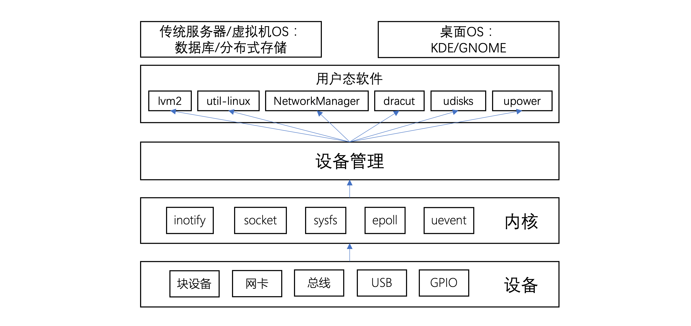

# devMaster: 新一代设备管理器

## 为什么要开发devMaster

设备管理器是系统中非常重要的组件，承担着设备热插拔感知、设备节点管理等关键工作，是用户态软件与底层物理设备之间的桥梁。sysMaster项目作为openEuler对新一代系统初始化和服务管理系统的探索，集成设备管理功能是必不可少的。devMaster作为sysMaster的设备管理模块，对Linux生态下主流设备管理方案的现状和优劣进行了总结和思考，旨在提供一种通用的、可扩展的、面向通用OS的设备管理能力。

## 主流的设备管理器

设备管理器的核心功能包括管理设备节点、创建设备软链接、设备热插拔检测等等。在不同的应用场景下，设备管理器提供的能力也会相应地扩展或裁剪。例如，在嵌入式和移动终端场景下，设备数量和种类相对固定且计算资源有限，因此设备管理器更趋向于功能精简和场景定制化，比如mdev仅支持热插拔时的设备节点更新、vold仅提供可插拔存储设备的挂载卸载功能等。而在通用服务器和桌面OS上，由于物理设备种类丰富、数量众多，且上层应用的业务逻辑更加复杂，这要求设备管理器提供更高的灵活性和可扩展性。

| 设备管理器   | 应用场景      | 说明                                                                     | 热插拔 | 并发处理 | 支持通用设备 | 策略定制 | 更新同步 |
| ------------ | ------------- | ------------------------------------------------------------------------ | ------ | -------- | ------------ | -------- | -------- |
| android vold | 移动终端设备  | 支持对可插拔存储设备的挂载和卸载管理                                     | ✔️      | ✔️        |              |          |          |
| busybox mdev | 嵌入式设备    | 利用内核的hotplug回调机制触发设备节点更新                                | ✔️      | ✔️        | ✔️            |          |          |
| systemd udev | 服务器/桌面PC | 主流的用户态设备管理器，具备良好的可扩展性，支持上层软件定制设备处理规则 | ✔️      | ✔️        | ✔️            | ✔️        | ✔️        |

udev作为极具代表性的通用OS用户态设备管理器，基本占据了主流的Linux发行版平台。相比于内核态的设备管理方案devfs/devtmpfs，udev提供更灵活、更强大的定制化设备处理能力，比如创建设备软链接、持久化命名、网卡保序等等，这使得上层软件可以更灵活、更方便地实现业务逻辑。但是随着HAL(hardware abstraction layer)和udev的功能整合，以及后续udev与systemd项目的合并，udev的功能越来越臃肿，越来越依赖于systemd的初始化系统生态，这违背了软件设计的分层解耦原则，导致其他软件被强行绑定到systemd生态中。

## devMaster的愿景

作为系统初始化以及常态运行下关键的系统功能，用户态设备管理器需要具备极高的可靠性、运行效率以及可扩展性，是支撑虚拟机/物理机启动与运行必不可少的系统组件。因此，devMaster的目标主要包含以下几点：

1. 消除系统层面的内存安全问题，减少运行故障的可能性，提高设备管理器的可靠性。
2. 保证系统南北向的兼容能力，支持从传统udev生态到devMaster的无缝迁移。
3. 采用分层解耦的软件设计，保证设备管理的轻量级、高效率，同时具备极致的可扩展能力。

## devMaster的特点

devMaster的软件架构遵循高内聚、低耦合的设计原则，保证各组件职责独立，提高软件可复用、可替换、可扩展能力，降低开发维测成本。devMaster主要包含四部分组件，分为常驻进程devmaster、客户端工具devctl、对外库以及兼容性工具。devMaster使用Rust语言编写，能够原生消除内存安全类问题。另外，devMaster具备以下主要特点：

1. 实时监听设备事件并触发规则处理，采用机制与策略分离的设计，将事件处理的行为定义在外部规则文件中，避免设备处理逻辑硬编码，并支持设备规则按需组合、扩展、裁剪。
2. 采用多线程的并发设计，并利用队列分级技术，提高事件处理的吞吐量，缓解设备竞争问题，增强高并发场景下设备管理器的鲁棒性，支撑OS秒级启动能力。
3. 通过客户端工具提供对devmaster的用户端控制接口，提升devmaster的可维可测能力，并兼容udevadm选项，支持用户使用习惯的平滑迁移。
4. 对外库提供开发者获取硬件设备信息以及与devmaster交互的对外接口，填补Rust语言在设备管理领域的三方库空白。
5. 提供完善的南北向兼容性工具，比如udev规则转译工具、对外库的Rust2C接口迁移、特殊设备组件等，支持udev到devmaster生态的无缝迁移。依托欧拉鸿蒙生态，打通嵌入式/物理机/虚拟机OS全场景。

总的来说，devMaster的设计旨在简化系统架构，并通过多项关键技术确保设备管理器具备机制的可扩展性、可靠性、可维可测能力、软件性能以及生态兼容能力，是一款非常有价值的设备管理工具。
