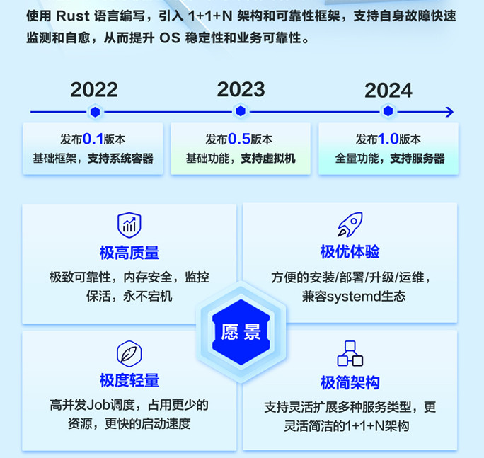

---
hide:
  - navigation
  - toc
---
# 中文

## 为什么我们要开发sysMaster

sysMaster是openEuler对当前Linux系统初始化和服务管理在嵌入式，服务器，云化等不同场景下面临的问题和特点进行总结和思考后，开展的一种改进和探索，提供统一的，能够支持嵌入式，服务器，云场景下的系统初始化和服务（进程，容器，虚拟机）管理系统。

<center></center>

## Linux的初始化系统和服务管理

我们都知道1号进程是所有Unix系统中由内核启动的第一个用户态进 程，它是操作系统正常工作的前提，它是操作系统初始化程序的代表（初始化实际包含一些的工具集合），并且需要一直运行在后台，回收孤儿进程，确保系统正常工作。
大家熟悉的初始化系统，有历史悠久的sysvinit，有Debian和Ubuntu等系统的Upstart，以及当前使用广泛的systemd，这些软件各有特点，具体可以参考下表:

| Init软件 | 说明                                                                             | 启动管理 | 进程回收 | 服务管理 | 并行启动 | 设备管理 | 资源控制 | 日志管理 |
| -------- | -------------------------------------------------------------------------------- | -------- | -------- | -------- | -------- | -------- | -------- | -------- |
| sysvinit | 早期版本使用的初始化进程工具,  逐渐淡出舞台。                                    | ✓        | ✓        |          |          |          |          |          |
| upstart  | debian,  Ubuntu等系统使用的initdaemon                                            | ✓        | ✓        | ✓        | ✓        |          |          |          |
| systemd  | 提高系统的启动速度，相比传统的System  V是一大革新，已被大多数Linux发行版所使用。 | ✓        | ✓        | ✓        | ✓        | ✓        | ✓        | ✓        |


Systemd对Sysvinit做出了很大的改进，尤其是启动速度上，功能也越来越丰富，但这也导致其系统架构和实现越来越复杂，在违背Keep It Simple的道路上越走越远。大而全的功能也不是所有场景都需要的，也不支持灵活组合，对于嵌入式以及一些IOT设备不能做很好的支持。同时与openEuler面向边缘，嵌入式，服务器，云场景OS的愿景不契合。

根据维护问题的统计追踪，Systemd每个版本引入的问题都不是一个收敛状态，并且近些年问题越来越多。而且由于1号进程特殊性，这些问题会带来系统级别的宕机。

<center></center>

## 云的服务管理

云化场景下，服务的管理对象由进程演变为虚拟机、容器，如通过OpenStack，k8s结合节点上的agent（kubelet，nova）进行管理。agent在node中通过Systemd进行管理，并且也使用了Systemd提供了一些基础能力，如日志输出。

对于Node（VM，Host）内部的一些关键服务，如Ngnix，通过Systemd进行生命周期的管理，并且这些服务也是分布式的，当前出现问题，由服务自行进行处理，无法像容器实例和虚拟机实例一样通过类似K8S、OpenStack平台统一编排。

<center></center>

## sysMaster应该聚焦什么？

操作系统的初始化以及系统中的服务管理，作为系统中非常重要的一个功能，随着场景和外部形式的变化，我们期望提供一套统一的系统初始化和服务管理框架，并且期望能够消除现有问题以及适应和符合传统场景和云场景的诉求。
对于Linux系统的初始化和服务管理，我们的目标是：

1. 消除现有初始化系统内存安全类问题，减少故障发生的可能性。
2. 支持快速部署、升级和恢复，达成故障秒级恢复，做到业务无感知。
3. 极致轻量，灵活，能够满足嵌入，服务器，云等场景对于资源开销的不同诉求。

对于云场景节点内部的运行实例（如容器，虚拟机，进程），我们的目标是：

1. 提供统一的实例生命周期的管理接口，对接分布式管理框架(如K8S和OpenStack),屏蔽容器引擎和虚拟化管理平台的差异。
2. 对于VM中的关键云化服务，能够复用当前云实例调度平台的能力，实现分布式管理。

## 极致可靠、轻量，满足嵌入式，服务器、云多种场景

<center></center>

sysMaster通过多级拆分的1+1+N架构，确保每个组件专注自己的职责，降低单组件的复杂性，确保组件架构的及简，从而提升系统整体架构扩展性，和适应性，并降低开发和维护的成本，并拥有以下主要特特点：

1. 轻量化调度，支持更快的启动速度
sysMaster-core为中的job调度器，事件驱动器来负责相关启动任务的处理，其中
job调度器：对启动服务任务进行调度，提供轻量化，并行化的调度能力，并且支持事务能力，保障服务启动的原子性。
事件驱动器：接受外部事件，并且驱动job调度器完成事件相关任务，如管理控制命令，设备发现等等。
2. 插件架构，支持服务类型灵活拓展
Unit管理器提供插件化机制，支持动态加载各种服务类型，支持服务的灵活扩展，实现按需加载。
3. 状态外置，多级还原点；语言级原生安全，支撑极致可靠
可靠性框架：支持状态外置，多级checkpoint支持自定义，并实现资源对账，数据自恢复，实现故障的快速自恢复，同时直至热升级能力，实现不中断业务的版本快速升级能力。
选择内存安全的Rust语言来进行开发，原生消除内存安全类问题，提高1号进程自身的鲁棒性，提升系统整体的可靠性。
4. 迁移工具支持Systemd到sysMaster无缝迁移。
提供生态迁移工具，支持客户和开发者从Systemd快速切换到sysMaster，实现无缝切换和迁移。
5. 原生支持鸿蒙和linux内核
sysMaster定位为支持嵌入式和服务器，云等全场景的支持，当前原生支持鸿蒙微内核和Linux内核。为微内核和宏内核提供统一的服务管理框架。

## 单节点运行对象生命周期管理的统一接口，对接分布式调度框架。

sysMaster吸收现有运化场景的一些特点，结合容器引擎(iSulad)和Qemu，提供统一的容器实例和虚拟化实例的管理接口，以及由sysMaster管理的一些关键应用实例的管理统一对接到Kubernetes和OpenStack。

<center></center>

## sysmaster项目里程碑及愿景

<center></center>


## 代码目录结构说明

源码仓库以workspaces方式管理，每一个目录是一个package，每个package包含一个crate（lib或bin形式），
公共lib crate的目录带lib前缀，使用cargo new --lib libtests创建,
daemon类型的bin crate的目录以d结尾。

```text
/ (根目录)
|...coms (插件)
|     |...service (unit type crate)
|     |...socket  (unit type crate)
|     |...target  (unit type crate)
|...libs (对外接口)
|     |...libtests (test lib crate)
|     |...cgroup (cgroup lib crate)
|     |...cmdproto(cmd proto lib crate)
|...exts (sysmaster-extends组件)
|     |...devmaster (daemon)
|     |...random-seed (bin)
|...core (sysmaster-core核心组件)
|     |...sysmaster (bin)
|     |...sysmaster (internal lib)
|...tools
|     |...musl_build
|     |...run_with_sd
|...docs
|...requirements.sh (安装依赖)
```

如：

```text
  - lib crate: libs/event, libs/basic
  - bin crate: extends/init, sysmaster
  - daemon crate: extends/udevd, extends/logind
```
