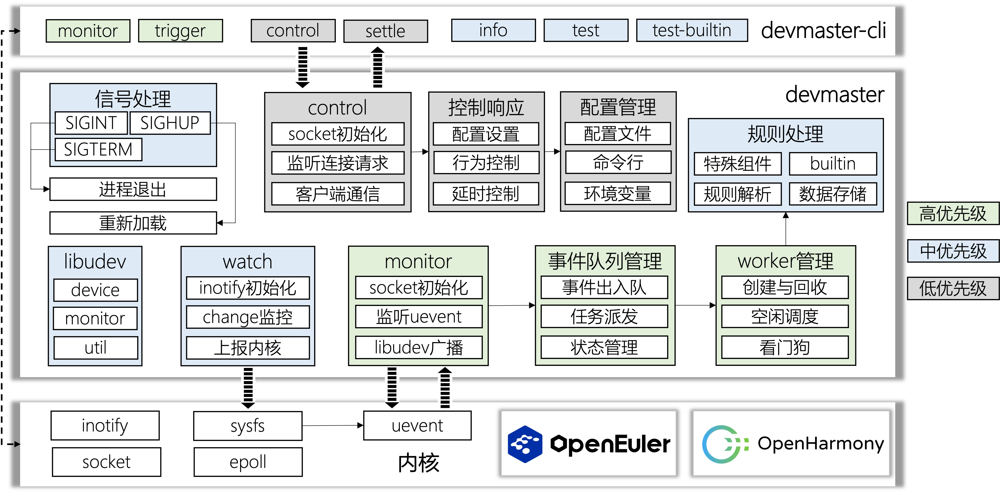

目 录

[TOC]

**Keywords** **关键词**： *devmaster*

**Abstract** **摘要**：*devmaster*是*sysMaster*项目的用户态设备管理模块，其采用机制与策略分离的设计思想，将设备事件感知与设备处理过程分割。*devmaster*在机制上通过监听内核上报的*uevent*事件感知设备热插拔行为，同时使用*inotify*机制监听设备节点的变化；*devmaster*在设备处理的策略上通过规则解析的方式，将设备事件的具体处理策略交给规则制定。为了提高设备处理效率，*devmaster*采用并发的方式，创建多个线程同时处理对多个设备。

**List of abbreviations** **缩略语清单**：

| Abbreviations缩略语 | Full   spelling 英文全名 | Chinese   explanation 中文解释 |
| ------------------- | ------------------------ | ------------------------------ |
|                     |                          |                                |
|                     |                          |                                |
|                     |                          |                                |
|                     |                          |                                |

# 1 概述

【关键内容】

devmaster是sysMaster的设备管理模块，是支撑sysMaster在虚拟机、物理机环境中系统启动的核心功能之一，同时也是支撑了系统硬件热插拔检测和处理。devmaster采用了机制和策略分离的架构，其提供了一套监听内核uevent事件和并发处理的程序框架，具体的设备事件处理策略则通过规则进行定义。

## 1.1 目的

【关键内容】

本文档主要针对devmaster的总体框架进行设计，明确主要组件以及各组件间的控制流、数据流关系，明确各个组件的技术方案和主要处理过程，作为后续编码阶段的开发指导。

# 2 特性需求概述

表2：特性需求列表

| 需求编号 | 需求名称                       | 特性描述                                                                                                                                                                                                                                              | 优先级 |
| -------- | ------------------------------ | ----------------------------------------------------------------------------------------------------------------------------------------------------------------------------------------------------------------------------------------------------- | ------ |
| 1        | monitor                        | 使用netlink机制注册socket，监听并接受内核上报的uevent事件，将事件输送到事件队列进行管理，同时承担libdevmaster对外广播的功能，每当某个事件处理结束后，向外广播处理结束的消息                                                                           | 高     |
| 2        | 事件队列管理                   | 使用队列数据结构管理monitor接受的uevent事件，将队列中的事件派发给worker进行并发处理，并及时更新队列与事件状态                                                                                                                                         | 高     |
| 3        | worker管理                     | 采用线程池模型创建并管理worker，当接收事件队列派发的任务时，从线程池中获取一个空闲的worker进行处理，如果不存在空闲worker，则创建一个新的worker线程进行处理,worker中进行规则处理，需要设计看门狗机制防止处理超时，当worker空闲过久时，需要进行线程回收 | 高     |
| 4        | 规则处理                       | 负责导入和管理规则文件，处理设备任务时需要执行规则解析动作，规则解析过程需要一些特殊设备组件与builtin工具的支持，并且需要实现hwdb对设备信息进行持久化存储                                                                                             | 中     |
| 5        | 信号处理                       | 接收SIGINT和SIGTERM信号时，进入进程退出流程，接收SIGHUP信号时，重新加载进程                                                                                                                                                                           | 中     |
| 6        | libdevmaster                   | 提供基础公共函数、数据结构等支持                                                                                                                                                                                                                      | 中     |
| 7        | watch                          | 使用inotify机制监控设备节点的IN_CLOSE_WRITE操作，并通过sysfs机制让内核上报设备的change事件                                                                                                                                                            | 中     |
| 8        | control                        | 使用UnixSocket机制，监听客户端程序devmaster-cli发起的连接请求，建立连接后进行报文交互，并根据控制请求进行控制响应                                                                                                                                     | 低     |
| 9        | 控制响应                       | 根据客户端程序的控制请求，进行配置设置、行为控制、延时控制等动作                                                                                                                                                                                      | 低     |
| 10       | 配置管理                       | 支持配置文件导入、解析命令行参数、解析环境变量等功能，对devmaster的运行参数进行控制                                                                                                                                                                   | 低     |
| 11       | devmaster-cli monitor命令      | devmaster-cli监听内核上报的uevent事件，并根据事件报文头区分报文来源自内核还是devmaster，实时打印                                                                                                                                                      | 高     |
| 12       | devmaster-cli trigger命令      | devmaster-cli通过sysfs机制触发指定动作的设备事件，再通过内核上报用户态程序                                                                                                                                                                            | 高     |
| 13       | devmaster-cli info命令         | devmaster-cli通过sysfs机制和读取数据库获取设备信息并打印                                                                                                                                                                                              | 中     |
| 14       | devmaster-cli test-builtin命令 | devmaster-cli用于调试builtin内置命令                                                                                                                                                                                                                  | 中     |
| 15       | devmaster-cli test命令         | devmaster-cli模拟设备事件，查看匹配的规则，用于调试规则解析                                                                                                                                                                                           | 中     |
| 16       | devmaster-cli control命令      | devmaster-cli与devmaster交互，向devmaster发送控制信息                                                                                                                                                                                                 | 低     |
| 17       | devmaster-cli settle命令       | devmaster-cli与devmaster交互，等待devmaster的事件队列清空                                                                                                                                                                                             | 低     |

# 3 需求场景分析

## 3.1 特性需求来源于价值概述

设备管理是支撑sysMaster在虚拟机、物理机环境下系统启动、热插拔控制等核心特性必不可少的功能模块。为了极致地发挥硬件性能并更好地提高软件的可扩展性、可维护性，需要设备管理程序提供一种事件驱动的、机制和策略分离的软件架构。

## 3.2 特性场景分析

使用该特性的用户主要为devmaster的开发者，根据该特性提供的软件框架和组件优先级管理开发进度，并进行阶段性的编码工作。

## 3.3 特性影响分析

该特性作为devmaster的总体框架，用于指导具体的编码过程，不涉及组件的实现细节。

## 3.4 友商实现方案分析

| 友商         | 特点                                                                                                                                                   |
| ------------ | ------------------------------------------------------------------------------------------------------------------------------------------------------ |
| systemd-udev | 事件驱动的用户态设备管理器，常驻进程持续监听内核uevent并监控设备变化。采用机制和策略分离架构，将设备处理逻辑剥离至规则中，通过worker机制并发处理多事件 |
| busybox-mdev | 利用sysfs机制主动创建设备节点，或使用内核hotplugin回调机制被动创建或删除设备节点。每触发一次uevent就会创建一个子进程，高并发场景下容易资源紧张         |
| android-vold | 处于Kernel和Framework之间，监听uevent事件并做简单的设备处理，复杂业务逻辑通过Framework层的存储管理器间接派发给具体服务和APP实现                        |
| macox X      | 由设备驱动直接创建设备节点，具体设备的处理策略需要具体分析                                                                                             |

# 4 特性/功能实现原理

## 4.1 总体方案

devmaster总体架构分两个粗粒度模块：服务端程序devmaster和客户端程序devmaster-cli。

1. devmaster：作为常驻进程持续监听内核上报的uevent事件，接收事件后获取空闲的worker或创新新的worker，并派发设备处理任务。同时，udevd会与客户端程序udevadm进行交互，对进行的运行状态进行控制。devmaster模块涉及的子模块描述见表2需求:1-10。
2. devmaster-cli：作为客户端程序，与devmaster进行交互，向服务端发送一些控制命令，同时也具备监听uevent事件、触发事件、调试规则等功能。devmaster-cli模块涉及的子模块见表2需求：11-17。

## 4.2 目录结构

1. 源码放置在extends目录下: extends/devmaster
2. 公共函数库放置在libs目录下: libs/libnetlink, libs/libdevice, 等
3. 规则文件与配置文件：待定

# 5    可靠性/可用性/Function Safety设计

NA

# 6    安全/隐私/韧性设计

NA

# 7    特性非功能性质量属性相关设计

NA

# 8    数据结构设计（可选）

本章节完成数据库结构的设计（数据库表结构，可以使用Power Designer完成），可选章节。

# 9    词汇表

| **词汇表** |          |
| ---------- | -------- |
| **名称**   | **描述** |
|            |          |
|            |          |
|            |          |
|            |          |
|            |          |
|            |          |
|            |          |
|            |          |
|            |          |
|            |          |
|            |          |
|            |          |
|            |          |
|            |          |
|            |          |

# 10   其它说明

NA

# 11   参考资料清单
