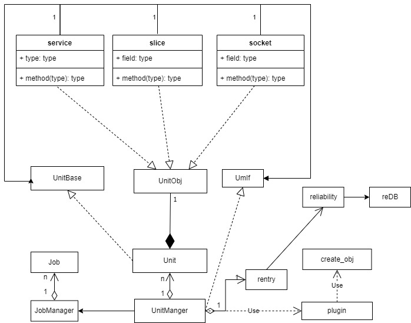

# unitManager的设计

## 简介

### 目的

Unit是SysMaster管理的基本单元，不同类型的Unit可以管理不同的资源，sysMaster Unit类型支持扩展，通过插件的方式，在启动过程中加载不同类型的Unit实现，来实现不同的业务目的。Unit管理分为两个阶段：

1. Unit加载：加载配置文件，并完成配置文件解析，生成Unit对象。
2. Unit执行：根据Unit配置文件，执行Unit定义的动作，并维护Unit状态。

### 上下文

unit是SysMaster管理的基本单元，是SysMaster对系统管理的入口，SysMaster主要是对Linux操作系统中，重点管理随系统开/关机流程的服务，以及在日常运行过程中，管理员、其他应用对系统中的应用/资源进行生命周期管理。

## 场景分析

### 业务场景分析

Linux在启动过程中，第一个启动的进程为1号进程，并且在1号进程启动后，需要对系统中的一些设备/初始化服务进行启动初始化，因此需要1号进程并且能够管理系统设备、应用初始化的管理框架。因此管理框架需要满足以下基本场景：

1. 从配置文件load相关的管理定义，并解析完成解析
2. 支持启动Unit
3. 支持停止Unit
4. 支持监控Unit状态。

除了以上基本场景，结合Linux系统的实际情况，以及已有的框架systemd框架，Unit和Unit之间有各种依赖关系，并且在系统启动过程中需要管理不同的资源，如磁盘设备初始化以及挂载，网络设备的初始化以及配置，应用程序的启动，系统其他资源/一些参数的初始化。

Linux系统还支持不同的启动模式，每种模式启动的Unit范围也不同，因此1号进程也要支持不同的启动模式/级别，启动不同的Unit的集合。

## 功能设计

### 功能域划分

结合场景分析，本章完成UnitManger功能域的划分，功能域的划分逻辑如下：

1. Unit为基本管理单元，并且会有不同类型的Unit，因此需要先抽象一个Unit接口层，并且需要有不同的实现。
2. 因为不同类型的Unit的存在，Unit管理框架设计成可扩展的，可以动态加载不同Unit的实现。
3. 每个Unit有独立的配置文件，因此需要有一个配置文件管理的模块，来管理Unit配置文件，并完成从配置文件解析生成Unit对象。
4. Unit状态会发生变化，并且还需要维护Unit的依赖关系，因此需要定义一个DataStore模块，统一存储Unit对象。
5. Unit对象是有生命周期的，因此需要有一个整体的管理模块，将所有模块串联起来。
6. Unit对象每次启动，通过Job出发，因此需要划分出一个Job引擎。



### unit接口定义

Unit接口定义Unit子类的公共行为，每种子类必须实现这些接口，具体的接口包含

### unit加载

#### unit的配置管理

每个unit都会包含配置文件，并且Unit的配置文件和Unit同名，并且以Unit的类型作为扩展名，如XXX.service, XXX.socket。

unit配置文件存储路径为：
|配置文件路径|   优先级           |
|    --     |   --              |
|/etc/sysmaster| 第一优先级      |
|/run/sysmaster| 第二优先级      |
|/usr/lib/sysmaster|  第三优先级 |

配置目录下可以存在同名的文件，同名的文件高优先级的会覆盖低优先级的的配置，Unit的配置文件和Unit的对应关系会在首次加载的时候完成缓存，只有在目录发生更新的时候才会刷新缓存的映射关系。

unit配置定义包含三个部分，具体描述如下：

 ```toml
[Unit]：所有Unit都可以配置的配置项，具体见uu_config::UeConfigUnit
[SelfDefSection]
[Install] Unit安装时（安装概念，见后续备注）的配置项
 ```

unit配置使用toml格式，通过对toml文件解析，填充到具体unit对象中，unit加载流程见下一章节

#### unit的加载

   unit对象加载是所有Unit执行后续的动作的前提，通过解析Unit的对应的配置文件，生成Unit对象，并加载到sysmaster内部，具体流程如下：


##### unit对象创建

unit对象包含unit以及子Unit，对象关系如下图：


unit为unitManger管理的单元，subUnit为子unit，每种类型都要求实现unitObj接口，不同类型有不同的的实现，通过Plugin框架来创建。

#### unit对象的存储

每个配置文件，解析完成之后，会生成一个unit对象，unit全局唯一，同一保存到datastore中，datastore使用hashmap，并且使用name作为key来保存unit对象。使用过程中，unit使用引用的方式更新数据，当前sysmater使用的是单线程，因此不考虑数据并发问题。
